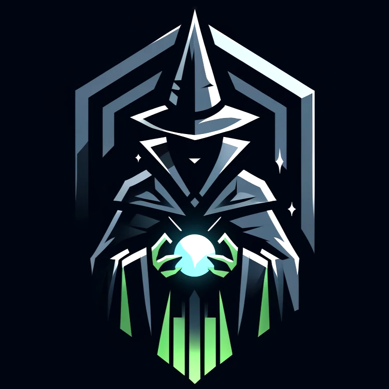

# RPG ARCADE
|  |  |
|:-------------:|:------------------------------------------------------------:|
|    

## Sobre o Projeto / EM DESENVOLVIMENTO

Este projeto é um jogo desenvolvido usando a biblioteca Pygame, um framework em Python amplamente utilizado para a criação de jogos 2D. Além disso, estou utilizando o Tiled Map Editor para criar os mapas do jogo, o que permite uma maior facilidade e flexibilidade na design de níveis.

## Características do Jogo

- **Gráficos 2D**: Utilizando os recursos visuais que o Pygame suporta, o jogo possui um estilo gráfico 2D simples, porém charmoso.
- **Mapas Customizados**: Cada nível do jogo é criado com o Tiled Map Editor, proporcionando um design único e envolvente para cada fase.
- **Controle de Personagens**: Implementação de movimentação básica e interações como saltar, correr e atacar.

## Objetivos de Aprendizado

- **Dominar a Pygame**: Aprender a usar todas as funcionalidades principais da Pygame.
- **Explorar Design de Mapas**: Aprofundar conhecimentos em design de mapas usando o Tiled.
- **Melhorar a Lógica de Programação**: Desenvolver habilidades de lógica de programação aplicadas ao contexto de jogos.
- 
## Tecnologias usadas

Para este projeto foi usada as seguintes tecnologias.

 

## Como Jogar

1. Clone este repositório para sua máquina local usando `git clone <url-do-repositório>`.
2. Certifique-se de ter Python e Pygame instalados.
3. Navegue até o diretório do jogo e execute `python startgame.py` para iniciar o jogo.

## Contribuições

Sugestões de melhorias, correções de bugs e qualquer tipo de feedback são sempre bem-vindos. Estou aberto a colaborações para aprender mais e melhorar o jogo.

---

Espero que você se divirta jogando e explorando este projeto tanto quanto eu me divirto criando-o!
## Sobre o autor

<!-- Coloque seu nome, uma foto sua e uma pequena bio sobre você na seguinte tabela: -->
|  |  |
|:-------------:|:------------------------------------------------------------:|
|    **Alan Bruno Morais Costa** | 
Me chamo Alan, sou estudante de Ciências da Computação na Universidade Federal de Mato Grosso (UFMT) e estou participando de um curso oferecido pela Cyber-edux. Neste repositório, apresento o Cardy, um sistema inovador de gerenciamento de tarefas e estudos projetado para melhorar a organização e eficiência de estudantes e profissionais.  |

- **Email:** alanbrunomoraescosta18@hotmail.com
- **LinkedIn:** [Alan's LinkedIn](https://www.linkedin.com/in/alan-morais-4861322b0)

